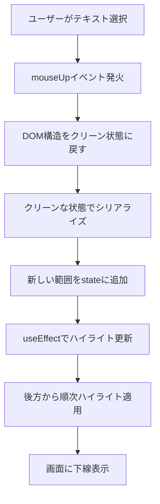

# RangyManualHighlightArea - 手動ハイライト機能付きテキストエリアコンポーネント

## 📋 概要

RangyManualHighlightArea は、HTML ドキュメント内でユーザーがマウス選択した範囲に自動的にハイライト（下線）を適用し、選択範囲の管理機能を提供する React コンポーネントです。Rangy ライブラリを使用してブラウザ間の互換性を確保し、複数の選択範囲を同時に表示・管理できます。

## ⚡ 主要機能

| 機能カテゴリ   | 詳細                               | 動作                                             |
| -------------- | ---------------------------------- | ------------------------------------------------ |
| **範囲選択**   | マウスドラッグによる自動ハイライト | テキスト選択 → 自動で赤い下線適用                |
| **範囲管理**   | 複数範囲の同時表示・保存           | 選択順序、テキスト、位置情報を保存               |
| **一覧表示**   | モーダルダイアログでの選択履歴表示 | 順番・選択テキスト・シリアライズデータ・作成日時 |
| **削除機能**   | 個別削除・全削除                   | 特定範囲の削除またはすべてクリア                 |
| **エラー処理** | Callback 方式でのエラー通知        | コンソールログ + 親コンポーネントへの通知        |

## 🔧 利用技術スタック

### **フロントエンド**

| 技術            | バージョン            | 用途                        |
| --------------- | --------------------- | --------------------------- |
| **React**       | 18.2.0                | UI フレームワーク           |
| **TypeScript**  | 5.2.2                 | 型安全な開発                |
| **Next.js**     | 13.5.6 (Pages Router) | React フレームワーク        |
| **Material-UI** | 5.14.0                | UI コンポーネントライブラリ |

### **専用ライブラリ**

| ライブラリ         | バージョン | 役割                           |
| ------------------ | ---------- | ------------------------------ |
| **Rangy**          | 1.3.1      | テキスト範囲選択・シリアライズ |
| **@emotion/react** | 11.11.0    | MUI のスタイリングエンジン     |

## 🚫 制限・注意事項

### **技術的制限**

| 制限項目           | 詳細                                    | 対策・回避策                |
| ------------------ | --------------------------------------- | --------------------------- |
| **DOM 構造依存**   | シリアライズデータは元の DOM 構造に依存 | 逆順適用・DOM 正規化で対応  |
| **ブラウザ互換性** | Selection API のタイミング差異          | setTimeout(10ms)で安定化    |
| **HTML 制限**      | dangerouslySetInnerHTML の制約          | 親 div 要素での構造分離     |
| **メモリ保存**     | ページリロードで状態消失                | useState 使用（永続化なし） |

### **機能制限**

| 制限項目       | 内容                                        |
| -------------- | ------------------------------------------- |
| **同時下線数** | 制限なし（ただし重複時は DOM 構造が複雑化） |
| **復元機能**   | 一覧表示のみ（クリック復元は削除済み）      |
| **スタイル**   | 固定（赤い 3px 下線）                       |
| **範囲重複**   | 重複範囲の選択は可能だが管理が複雑          |

## 📚 API リファレンス

### **Props**

```typescript
interface RangyManualHighlightAreaProps {
  html: string; // 表示するHTMLコンテンツ
  onError?: (error: Error) => void; // エラー時のコールバック
  onRangeSelect?: (range: SavedRange) => void; // 範囲選択時のコールバック
  onRangeDelete?: (id: number) => void; // 範囲削除時のコールバック
}
```

### **SavedRange 型**

```typescript
interface SavedRange {
  id: number; // 一意識別子
  order: number; // 選択順序
  serialized: string; // Rangyシリアライズデータ
  text: string; // 選択されたテキスト
  timestamp: string; // 作成日時
}
```

## 🎯 使用例

### **基本的な使用**

```tsx
<RangyManualHighlightArea html={htmlString} />
```

### **完全なイベントハンドリング**

```tsx
<RangyManualHighlightArea
  html={documentHtml}
  onError={(error) => {
    console.error("エラー:", error.message);
    setErrorMessage(error.message);
  }}
  onRangeSelect={(range) => {
    console.log("新しい範囲:", range.text);
    saveToExternalSystem(range);
  }}
  onRangeDelete={(id) => {
    console.log("削除された範囲ID:", id);
    removeFromExternalSystem(id);
  }}
/>
```

## 📦 インストール・セットアップ

### **必要な依存関係**

```bash
npm install rangy @mui/material @emotion/react @emotion/styled
npm install -D @types/rangy typescript
```

### **型定義ファイル**

`types/rangy.d.ts`で Rangy ライブラリの型定義補完が必要

## 🔄 動作フロー



## 🎨 カスタマイズポイント

| 項目               | 変更箇所                 | 例                      |
| ------------------ | ------------------------ | ----------------------- |
| **下線スタイル**   | `borderBottom`プロパティ | `'2px dashed blue'`     |
| **UI 色**          | MUI の sx プロパティ     | `color: 'primary.main'` |
| **最小高さ**       | `minHeight`プロパティ    | `300px`                 |
| **フォントサイズ** | ダイアログの`fontSize`   | `'1rem'`                |

## 🧪 開発・デバッグ

### **ログ出力内容**

- Rangy 初期化状況
- 範囲選択・削除イベント
- ハイライト適用順序
- エラー詳細情報

### **デバッグ用コンソールコマンド**

```javascript
// 現在のハイライト要素を確認
document.querySelectorAll('[class*="rangy-underline"]');

// DOM構造の確認
console.log(document.querySelector('[ref="contentRef"]').innerHTML);
```
